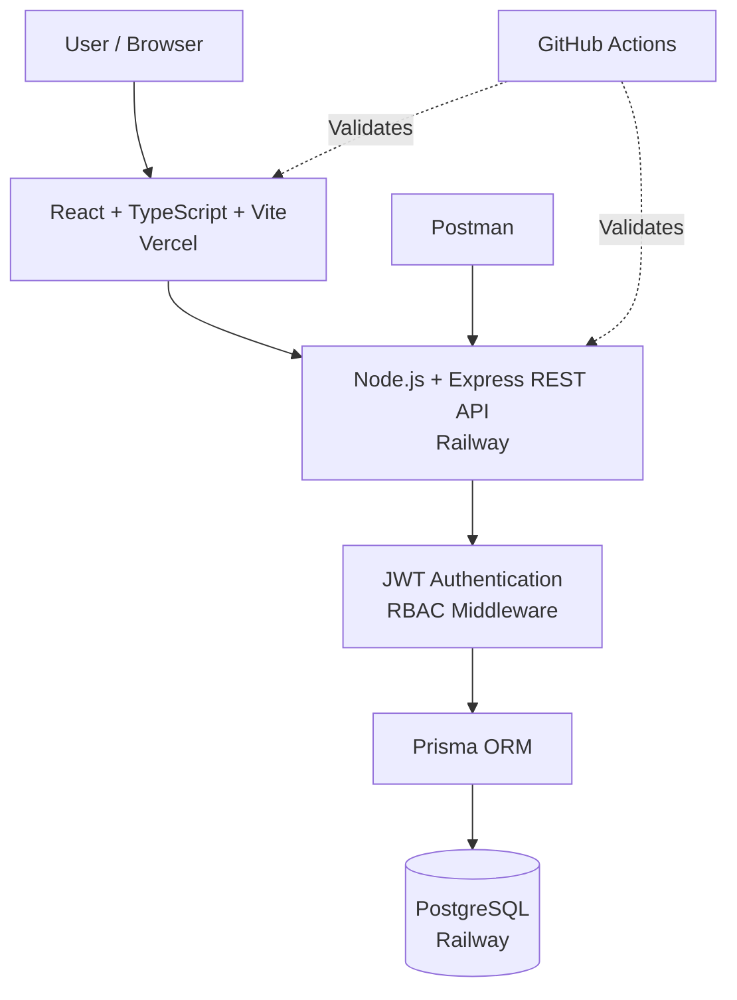
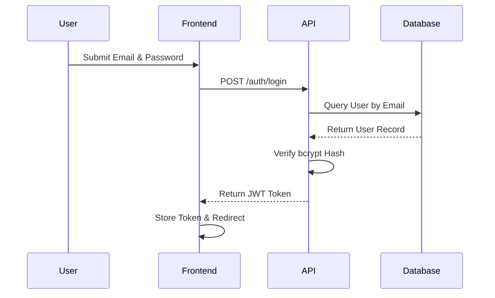
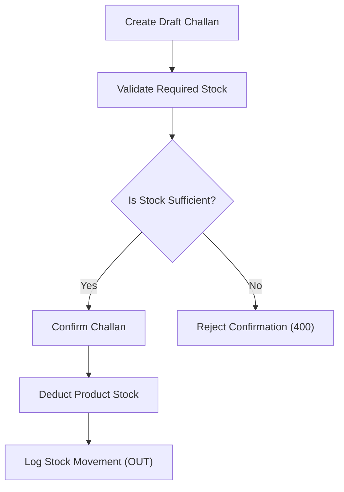
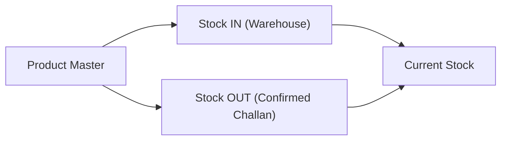
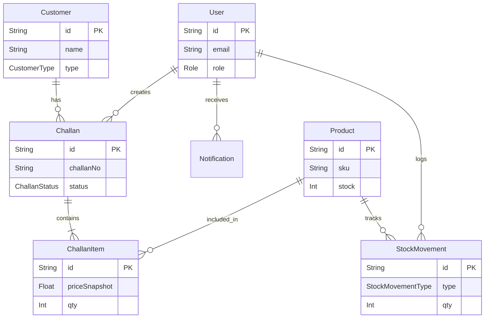

## Mini ERP + CRM Operations Portal

A full-stack ERP and CRM platform for managing customers, products, inventory, sales challans, and role-based business operations.

## Project Links

[Live Application](https://mini-erp-crm-portal-vert.vercel.app/) ·
[Backend API](https://mini-erp-crm-portal-production.up.railway.app/) ·
[GitHub Repository](https://github.com/Sagarchhetri83/mini-erp-crm-portal) ·
[Postman Collection](./mini_erp_postman_collection.json) ·
[GitHub Actions](https://github.com/Sagarchhetri83/mini-erp-crm-portal/actions)


## Demo Access

The live application is available for evaluation using the following demo accounts.

| Role | Email | Password |
|------|-------|----------|
| Admin | `admin@erp.com` | `Password123` |
| Sales | `sales@erp.com` | `Password123` |
| Warehouse | `warehouse@erp.com` | `Password123` |
| Accounts | `accounts@erp.com` | `Password123` |

These are demonstration accounts created by the database seed process. They do not contain production credentials or sensitive user data.

### Recommended Starting Point

For the complete application workflow, use the **Admin** account first.

1. Open the [Live Application](https://mini-erp-crm-portal-vert.vercel.app/)
2. Sign in with `admin@erp.com`
3. Password: `Password123`
4. Explore Dashboard, Analytics, Customers, Products, Inventory and Sales Challans.
5. Other accounts can be used to verify role-based access control.

---

## Project Overview

Fundsroom provided the business requirements for a centralized Mini ERP and CRM Operations Portal designed to handle internal workflows. The application aims to solve operational disjointedness by combining customer relationship management, real-time inventory tracking, and sales challan (invoicing) generation into a single, cohesive system. 

The application manages customers, product catalogs, physical inventory levels, and transactional sales orders. My technical approach involved architecting a normalized PostgreSQL database, building a secure Express REST API to enforce strict inventory and access rules, and developing a dynamic, role-based React frontend to provide specific views for administrative, sales, warehouse, and accounting personnel.

| Item | Details |
|---|---|
| Project Type | Full-Stack ERP + CRM |
| Client / Requirements | Fundsroom |
| Frontend | React + TypeScript + Vite |
| Backend | Node.js + Express + TypeScript |
| Database | PostgreSQL |
| ORM | Prisma |
| API Testing | Postman |
| CI | GitHub Actions |
| Frontend Deployment | Vercel |# Mini ERP + CRM Operations Portal


| Backend / Database | Railway |

## 1. Problem Statement

A common operational challenge in business is managing disparate data across departments. Without a unified system, customer records, physical stock counts, and sales orders are managed in isolation, leading to inventory discrepancies, miscommunications, and uncoordinated sales efforts. 

The objective of this project was to bring together customer management, follow-ups, products, inventory, stock movements, sales challans, user access, analytics, and operational notifications into one portal. By connecting the CRM directly to sales challans and tying those challans strictly to inventory ledgers, the system ensures data consistency across the entire business workflow.

## 2. Requirements and Functional Scope

### Authentication and Roles
The system must securely authenticate users and restrict access based on assigned department roles, ensuring employees only interact with data relevant to their responsibilities.

### Customer CRM
A centralized database for managing clients (retail, wholesale, and distributor), tracking their lead status, business information, and follow-up schedules.

### Product Management
A master catalog of products tracking pricing, SKUs, and configured minimum stock thresholds.

### Inventory and Stock Movements
An immutable history of all inventory changes (both IN and OUT) to prevent undocumented stock loss and maintain an auditable physical stock ledger.

### Sales Challans
A multi-step sales workflow where orders begin as editable drafts and are later confirmed, at which point they lock the items and officially deduct physical inventory.

### Analytics and Administration
High-level insights, metrics, and user-management capabilities allowing business administrators to oversee overall performance.

## 3. Development Approach

1. Understand the business workflow
2. Identify roles and permissions
3. Design the relational data model
4. Define REST API boundaries
5. Implement authentication and RBAC
6. Implement CRM
7. Implement product and inventory management
8. Implement challan workflow
9. Add stock validation and transactions
10. Build the React frontend
11. Integrate frontend and backend
12. Test APIs and business rules with Postman
13. Configure CI with GitHub Actions
14. Deploy backend/database to Railway
15. Deploy frontend to Vercel
16. Validate production behaviour

## 4. System Architecture



- **Frontend:** A React Single Page Application (SPA) that manages UI state, routing, and token storage.
- **Backend:** An Express REST API that handles all business logic, data validation, and authorization.
- **Authentication:** Middleware that verifies JSON Web Tokens on protected routes before reaching the controller logic.
- **Prisma:** The Object-Relational Mapper handling database migrations and type-safe queries.
- **PostgreSQL:** A relational database holding the application's persistent state.
- **Postman:** An automated API testing suite validating constraints and business rules.
- **GitHub Actions:** CI pipeline automatically validating builds and type checks on code changes.
- **Deployment:** Vercel serves the static frontend assets via CDN, while Railway hosts the Node.js API runtime and managed PostgreSQL database.

## 5. Application Workflows

### Authentication Flow


### Sales Challan Flow
Draft challans act as pending orders and do not deduct stock. Confirmation is the definitive point where physical inventory changes.



### Stock Movement Flow


## 6. Technology Stack

| Layer | Technology | Purpose |
| :--- | :--- | :--- |
| **Frontend** | React | UI |
| **Language** | TypeScript | Type safety |
| **Build** | Vite | Build tooling |
| **Routing** | React Router | SPA routing |
| **HTTP** | Axios | API communication |
| **Backend** | Node.js + Express | REST API |
| **Authentication** | JWT | Authentication |
| **Password Hashing** | bcryptjs | Password hashing |
| **ORM** | Prisma | Database access |
| **Database** | PostgreSQL | Relational persistence |
| **Testing** | Postman | API testing |
| **CI** | GitHub Actions | Automated validation |
| **Frontend Hosting** | Vercel | Frontend deployment |
| **Backend Hosting** | Railway | API deployment |
| **Database Hosting** | Railway | PostgreSQL |

## 7. Frontend Architecture

```text
frontend/
├── src/
│   ├── components/
│   ├── context/
│   ├── lib/
│   ├── pages/
│   ├── App.tsx
│   └── main.tsx
├── public/
├── vercel.json
└── package.json
```

- **Routing:** Handled entirely client-side by React Router within `App.tsx`.
- **Authentication Context:** `AuthContext` manages the global user state and token presence.
- **API Layer:** `lib/axios.ts` intercepts requests to automatically attach the JWT Authorization header.
- **Protected Routes:** A wrapper component checks authentication state before rendering protected content.
- **Role-Based Navigation:** The UI dynamically adjusts layout options based on the authenticated user's role.
- **Reusable Components:** Shared UI elements (badges, buttons, tables) to maintain visual consistency.
- **Page Modules:** Domain-specific views categorized into Customers, Products, Challans, Analytics, and Settings.

## 8. Backend Architecture

```text
backend/
├── prisma/
│   ├── migrations/
│   ├── schema.prisma
│   └── seed.ts
├── src/
│   ├── middleware/
│   ├── routes/
│   └── index.ts
└── package.json
```

- **Express Server:** Entry point in `index.ts` configuring standard middleware.
- **Routes:** Modular endpoint definitions mapping HTTP methods to business operations.
- **Middleware:** Request interception before route handlers.
- **Authentication:** Validates JWT structure and expiration.
- **RBAC:** Verifies the extracted JWT role against allowed route roles.
- **Prisma:** Direct database interaction via generated client.
- **Validation:** Input payload checking on POST/PUT endpoints.
- **Error Handling:** Centralized `try/catch` blocks returning standardized JSON error codes.
- **CORS:** Configured to allow cross-origin requests from the frontend domain.
- **Environment Configuration:** Relies on `dotenv` to load secrets and external URLs.

## 9. Authentication and Security

Authentication is stateless. The `/auth/login` endpoint looks up the user by email, securely compares the submitted password against the stored `bcrypt` hash, and generates a signed JWT.

This JWT is returned to the client and must be included in the `Authorization: Bearer <token>` header for all subsequent protected API requests. The backend JWT middleware decodes this token; if invalid or missing, it rejects the request with a `401 Unauthorized`. If the token is valid but the user's role is insufficient for the requested route, the RBAC middleware rejects it with a `403 Forbidden`.

CORS is strictly configured to communicate only with the frontend application. Environment variables manage secrets to prevent hardcoding sensitive data into the repository. No demo passwords or secrets are ever exposed publicly.

## 10. Role-Based Access Control

| Module | ADMIN | SALES | WAREHOUSE | ACCOUNTS |
| :--- | :--- | :--- | :--- | :--- |
| **Dashboard** | ✓ | ✓ | ✓ | ✓ |
| **Analytics** | ✓ | - | - | ✓ |
| **Customers** | ✓ | ✓ | - | - |
| **Products** | ✓ | - | ✓ | - |
| **Stock** | ✓ | - | ✓ | - |
| **Challans** | ✓ | ✓ | - | ✓ |
| **Users** | ✓ | - | - | - |

## 11. CRM

The CRM module manages the company's client base. Authorized users can add and edit customers, assign customer types (Retail, Wholesale, Distributor) and statuses (Lead, Active, Inactive). The interface provides searching and filtering mechanisms. Detailed views present business names, GST information, follow-up dates, and related notes. Because customers are related to sales challans in the database, users can track the complete relationship history of client orders directly through the CRM.

## 12. Inventory

The inventory system maintains product master data, including SKU, base price, current stock levels, and minimum stock alerts.

Stock movements are tracked independently from the product's current stock integer. When stock is added (IN) or deducted (OUT), a dedicated `StockMovement` record is logged with the quantity and reason. This provides a highly auditable history, ensuring that the current stock level can always be traced back to exact physical movements rather than relying on a silently updated number. Low-stock logic alerts users when current inventory falls below the designated threshold.

## 13. Sales Challans

The sales challan workflow facilitates order creation and invoicing. The user selects a customer and adds products with specified quantities to create a draft challan. Upon creation, an automatic, sequential challan number is generated. 

Draft challans act as pending quotes—they do not affect physical inventory and can be edited or cancelled. Once the order is finalized, the user confirms the challan. The backend validates that the requested quantities do not exceed available stock. If valid, the system deducts the stock, logs the corresponding stock movements, changes the challan status to confirmed, and allows the generation of a printable browser-based invoice.

## 14. Database Design

The relational database is architected with Prisma.



- **User:** Stores authentication credentials, roles, and status fields.
- **Customer:** Manages CRM details, types, and follow-up data.
- **Product:** The inventory master catalog.
- **Challan:** The parent invoice record holding customer references, total amounts, and overarching status (DRAFT/CONFIRMED/CANCELLED).
- **ChallanItem:** Separated from Challan to normalize the database, storing individual product lines. It includes a `priceSnapshot` to lock the price at the time of creation, preserving historical integrity if the master product changes. Deleting a Challan cascades to delete its ChallanItems.
- **StockMovement:** An append-only ledger tracking all IN and OUT inventory changes.
- **Notification:** System alerts directed at specific users.

## 15. Business Logic

### Draft Challan
Creating a draft challan generates a document but does not reduce stock. It is a completely safe operation regarding physical inventory.

### Stock Validation
When confirming a challan, the backend compares the requested quantity with available stock.
- Required: 400
- Available: 300
- Result: Request rejected with a 400 Bad Request.
- Stock changed: No.

### Challan Confirmation
If stock is sufficient, the system deducts the quantities, writes an OUT record to the StockMovement ledger, and sets the challan status to CONFIRMED.

### Transaction Safety
The challan confirmation logic is wrapped in a Prisma `$transaction`. This guarantees atomicity—if the stock deduction succeeds but the status update fails, the entire operation rolls back to prevent inconsistent states.

### Negative Stock
Inventory is strictly protected; the backend logic and database prevent product stock from becoming negative under any circumstances.

### Product Snapshot
The `ChallanItem` schema natively supports `priceSnapshot` and `productName` fields, isolating historical invoices from future catalog alterations.

### Challan Numbering
The backend automatically increments and formats unique document identifiers based on existing database entries.

## 16. REST API

| Method | Endpoint | Authentication | Purpose |
| :--- | :--- | :--- | :--- |
| `POST` | `/auth/login` | Public | Login |
| `GET` | `/customers` | JWT | List customers |
| `POST` | `/customers` | JWT + role | Create customer |
| `GET` | `/products` | JWT | List products |
| `POST` | `/products` | JWT + role | Create product |
| `GET` | `/challans` | JWT | List challans |
| `POST` | `/challans` | JWT + role | Create draft challan |
| `GET` | `/challans/:id` | JWT | View challan details |
| `POST` | `/challans/:id/confirm`| JWT + role | Confirm challan |
| `DELETE` | `/challans/:id`| JWT + role | Cancel draft challan |
| `GET` | `/users` | JWT + role | List system users |
| `GET` | `/analytics/:role` | JWT | Fetch dashboard metrics |

## 17. Postman Testing

The repository includes `mini_erp_postman_collection.json` containing the full API validation suite.

The collection tests authentication endpoints, standard CRUD operations, RBAC enforcement, invalid credentials, missing/invalid tokens, insufficient stock rejections, and the complete challan workflow.

| Result | Count |
| :--- | :--- |
| Total | 53 |
| Passed | 53 |
| Failed | 0 |
| Errors | 0 |
| Skipped | 0 |

### Postman Test Results


## 18. GitHub Actions

The CI workflow automatically validates code integrity on pushes and pull requests.

```text
.github/
└── workflows/
    └── ci.yml
```

The workflow runs on `ubuntu-latest` against Node 20. It triggers parallel jobs for the frontend and backend. Both jobs execute `npm ci` to cleanly install dependencies, followed by type checking and build commands. The frontend job additionally runs linting checks. The workflow acts strictly as a validation pipeline and does not deploy the application. 


## 19. PostgreSQL + Prisma

The application utilizes PostgreSQL as its relational database. Prisma maps the relational model into type-safe JavaScript objects. The `schema.prisma` file defines all models, relationships, and enums. Migrations track schema changes, and a seed file populates initial development data. The backend explicitly leverages Prisma `$transaction` blocks to ensure data integrity during complex multi-table writes.

### PostgreSQL Local


## 20. Railway Deployment

The backend Express API and the PostgreSQL database are deployed on Railway.

Railway provisions a managed PostgreSQL service on an internal network. The Node.js API service connects to it using securely provided environment variables. During deployment, Railway builds the application and runs the defined start command. This command securely executes the Prisma deployment migration before starting the server, ensuring the database is correctly structured to accept traffic.

Production backend: [https://mini-erp-crm-portal-production.up.railway.app](https://mini-erp-crm-portal-production.up.railway.app)

### Railway Backend


### Railway PostgreSQL


## 21. Vercel Deployment

The React frontend is deployed to Vercel directly via GitHub integration.

Vercel builds the `frontend` root using Vite, outputting static files to the `dist` directory. The production `VITE_API_URL` environment variable points to the Railway backend. The `vercel.json` file ensures that client-side SPA routing correctly falls back to `index.html` to prevent 404 errors on direct navigation.

Production frontend: [https://mini-erp-crm-portal-vert.vercel.app](https://mini-erp-crm-portal-vert.vercel.app)

### Vercel Deployment


## 22. Environment Variables

Local development requires the following environment variables. Actual secrets are never committed to the repository.

**Backend:**
- `DATABASE_URL`
- `JWT_SECRET`
- `PORT`
- `FRONTEND_URL`

**Frontend:**
- `VITE_API_URL`

## 23. Local Development

**Prerequisites:** Node.js v20+ and PostgreSQL.

1. **Clone Repository**
   ```bash
   git clone <repository-url>
   cd mini-erp-crm-portal
   ```

2. **Backend Setup**
   ```bash
   cd backend
   npm install
   # Configure backend/.env
   npx prisma migrate dev
   npm run seed
   npm run dev
   ```

3. **Frontend Setup**
   ```bash
   cd frontend
   npm install
   # Configure frontend/.env
   npm run dev
   ```

## 24. Production Deployment Flow

Code is pushed by the developer to GitHub. GitHub Actions intercepts the push to perform CI validation on the frontend and backend builds. Concurrently, Railway detects backend repository changes, pulls the code, applies database migrations, and deploys the Node.js API. Vercel detects frontend changes, builds the Vite application, and distributes the updated UI to its edge CDN.

## 25. Screenshots

### Login


### Dashboard


### Analytics


### Customer Details


### Products


### Sales Challans


### Challan Details


### Printable Challan


## 26. Testing Strategy

Testing spans multiple application layers:
- **API Level:** Postman assertions on status codes and payloads.
- **Authentication:** Forcing `401 Unauthorized` responses with invalid credentials.
- **Authorization:** Verifying `403 Forbidden` responses when circumventing RBAC rules.
- **Negative Scenarios:** Passing malformed inputs to test API error boundaries.
- **Inventory Business Rules:** Ensuring negative stock transactions fail gracefully with `400 Bad Request`.
- **Challan Workflow:** Testing document lifecycle progression from draft to confirmation.
- **CI:** Automated build checks and TypeScript validation via GitHub Actions.

## 27. Design Decisions

- **React + TypeScript:** Component-based UI with static typing eliminates a large class of runtime bugs.
- **Express:** Lightweight routing ideal for a focused REST API.
- **PostgreSQL:** Reliable relational constraints critical for transactional ERP data.
- **Prisma:** Type-safe database queries natively integrated with TypeScript.
- **JWT:** Stateless authorization perfect for horizontally scalable APIs.
- **RBAC Middleware:** Centralized access control preventing logic leakage into route handlers.
- **Separate Challan and ChallanItem:** Normalizes data to allow multiple products per invoice.
- **StockMovement Ledger:** Provides an auditable inventory history instead of just a mutable stock integer.
- **Draft/Confirmed Workflow:** Separates order intention from actual physical inventory deduction.
- **Railway:** Seamless Node.js + PostgreSQL integrated deployment.
- **Vercel:** High-performance edge delivery optimized for Vite/React SPAs.

## 28. Challenges and Solutions

A key challenge involved guaranteeing that confirming a sales challan perfectly aligned with deducting stock. A network timeout or server crash midway through processing could result in deducted stock without a confirmed invoice status. The solution was strictly wrapping the stock deduction and challan status update operations inside a Prisma `$transaction`. This ensured that if either part failed, the entire operation would safely roll back, preserving database integrity.

## 29. Limitations

- Native product image uploads are not supported.
- Email notifications are not implemented; alerts rely solely on in-app polling.
- Document generation relies on browser-based printing capabilities rather than server-side PDF generation.
- Pagination is implemented primarily as simple limit-based queries.

## 30. Future Improvements

- Docker containerization for standardized local setups.
- Server-side PDF generation using libraries like Puppeteer.
- Amazon S3 integration for durable object storage.
- SMTP email notifications for customer follow-ups and invoices.
- Advanced cursor-based pagination across data grids.
- Broader CI/CD pipeline expanding into automated E2E testing.

## 31. Author

**Sagar Chhetri**  
BTech — Computer Science & Engineering (Cybersecurity)  
Full-Stack Development · Backend Development · Cybersecurity

## License

This project is licensed under the MIT License. See the [LICENSE](LICENSE)
file for details.
